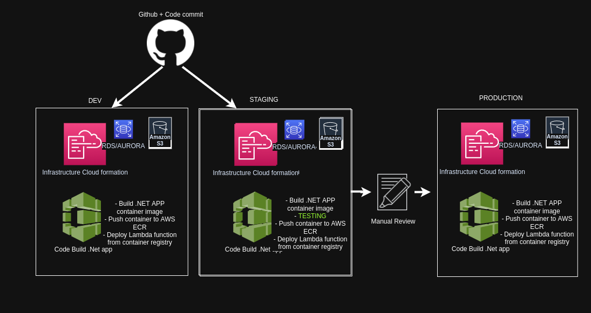

# .Net Lambda Multi-Enviroment CI/CD Pipeline

A multi-environment CI/CD pipeline that builds & deploys .Net containers images into AWS Lambda.

## Files Overview

Files Added: 
- `Pipeline.yaml` - Cloudformation template to build the pipeline. ** You have to manually deploy this template **
- `Application-infrastructure.yaml` - Cloudformation template that Codepipeline will deploy. (Contains AuroraDB, EFS, and Lambda infrastructure configuration)
- `Codebuild.yaml` - Configuration file that specifies the building steps for codebuild. 

## Conceptual Understanding
To put simply, this project is a pipeline that deploys software(.Net C# code) into AWS(Lambda). 
However, because AWS Lambda does not support the latest .Net runtime that the C# code uses, we are thus required to use containerized lambda images. https://docs.aws.amazon.com/lambda/latest/dg/images-create.html 

By using lambda container images, we create an image with the latest .NET runtime pre-installed and package our code inside that image. 

The AWS Lambda relies on other AWS services(Aurora DB and EFS), creating an environment. 
We have 3 Environments,Dev,testing, and production defined in the pipeline.yml file. 

Here is a breif overview of each environment: 

Dev - This environment simply spins up the resources from the `Application-infrastructure.yaml`,sources the artifacts(C# code) from a Github repo, creates an image from the artifact code and uploads that image to an ECR reposity, and then finally deploys that image into AWS Lambda. 

Testing - This is exactly like Dev, except it introduces a testing phase. When the artifacts are sourced from the github repo, they are then unit-tested. If the unit test passes, the pipeline continues. If the unit test fails, the pipeline will fail and stop running. 

Production - This is exactly like Testing, except the AWS resources that are spun up in this environment are more powerful,better suited for production workloads. For example, Aurora DB runs on free-tier for dev & testing, but runs on production mode in the Production environment. 

## Instructions

Here is a basic summary of what you will need to do: 
1. Create a new Github Oath token. 
2. Fork this Repository. 
3. Manually deploy the `pipeline.yaml` template into your AWS account. 

First will need a Github-OATH token:

https://docs.github.com/en/authentication/keeping-your-account-and-data-secure/creating-a-personal-access-token

Follow the instructions in the URL and keep the token safe. You will need it later on. 
Note: Please ensure you are the owner of the repository that is being sourced. 

# Important Notes

### VPC Increase limits:
This project deploys 3 VPCS(dev-vpc,test-vpc,prod-vpc) into the region you specify. It may be the case that you hit the max vpcs per region limit (limit = 5) . You will need to contact AWS to increase the limit or use a different region altogether. 
https://richardvigilantebooks.com/how-can-i-increase-vpc-limit-in-aws/
